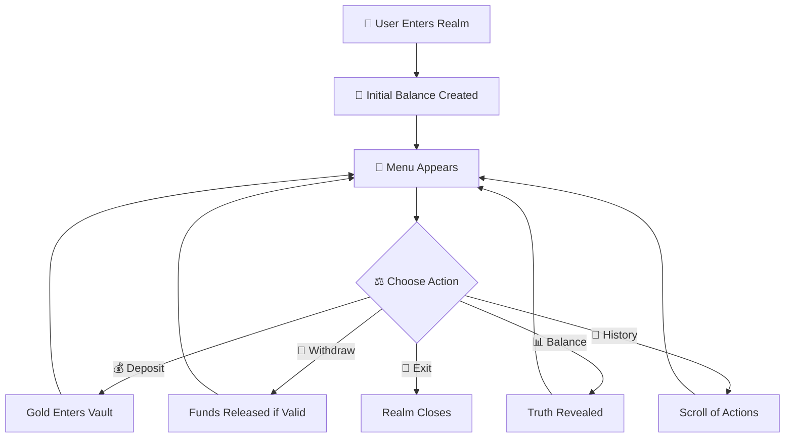
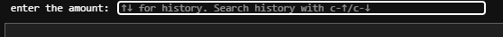
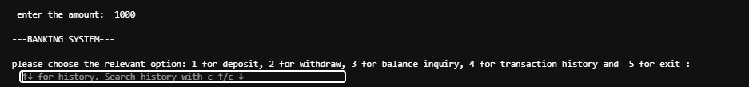
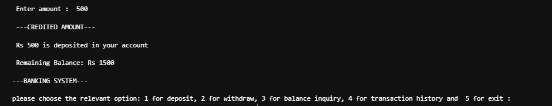
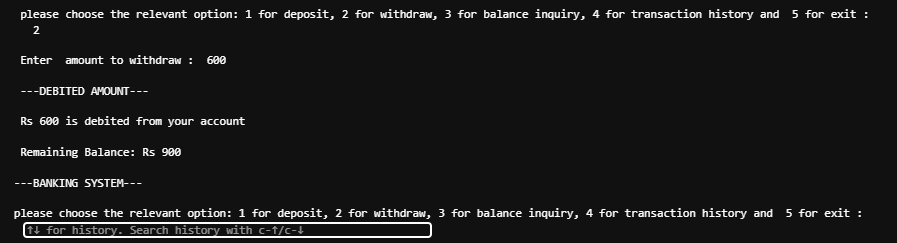
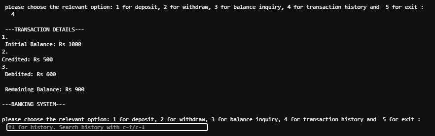
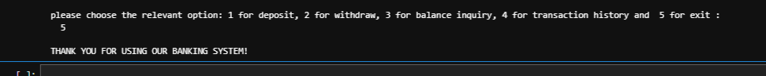

<div align="center">


### ✨ A Digital Tale of Transactions, Trust & Balance


</div>

---

# 🌙 Prologue — The System Awakens

> In a quiet digital realm, a simple Python script comes alive…  
> It becomes a **guardian of balance**, a keeper of transactions, and a storyteller of every deposit and withdrawal.

---

# 🏛️ The Kingdom (System Overview)

<div align="center">

| 🌿 Element | 📜 Meaning |
|---|---|
| 💰 Deposit | Adding value to your vault |
| 🏧 Withdraw | Controlled release of assets |
| 📊 Balance | The truth of your treasury |
| 🧾 History | Memory of all actions |
| 🛡️ Validation | Protection against chaos |

</div>

---

# 🪄 Arcane Mechanics (Tech Essence)

```text
Python 🐍 → The spell language  
Functions ⚙️ → The magic rituals  
Loops 🔁 → Eternal system cycle  
Lists 📜 → Memory scrolls of transactions  
Conditionals 🔮 → Decision gates of logic  
```

---

# 🧭 The Journey Flow

<div align="center">



</div>

---

# 🧾 Chronicle of Events (Sample Tale)

```text
🏦 The Vault opens with: Rs 1000

✨ A traveler deposits Rs 500
→ The treasury grows stronger

⚔️ A withdrawal of Rs 200 occurs
→ Guard checks balance… approved

📊 Final Balance: Rs 1300

🧾 Every action is inscribed into memory scrolls
```
---
# 📸 Execution Proof

<div align="center">


<br><br>

<br><br>

<br><br>

<br><br>

<br><br>

<br><br>


</div>
---

# 🌌 Sacred Laws of the System

<div align="center">

✨ No withdrawal beyond balance  
✨ Every action is recorded  
✨ System never forgets transactions  
✨ Logic protects the vault from error  

</div>

---

# 🔮 Future Prophecies

<div align="center">

| 🔮 Vision | 🌙 Evolution |
|---|---|
| 🧿 PIN Guardian | Secure identity layer |
| 📦 Persistent Vault | File-based memory system |
| 🧠 Smart Interest Engine | Growth of assets over time |
| 🖥️ Enchanted GUI | Visual banking realm |
| 🌐 Web Realm | Browser-based expansion |

</div>

---

# 🕊️ Epilogue

<div align="center">

> “Even in a world of logic, every transaction becomes a small story of trust.”  

<br>

✨ Built with Python | Designed with imagination | Crafted with precision ✨

</div>

---

<div align="center">


</div>
